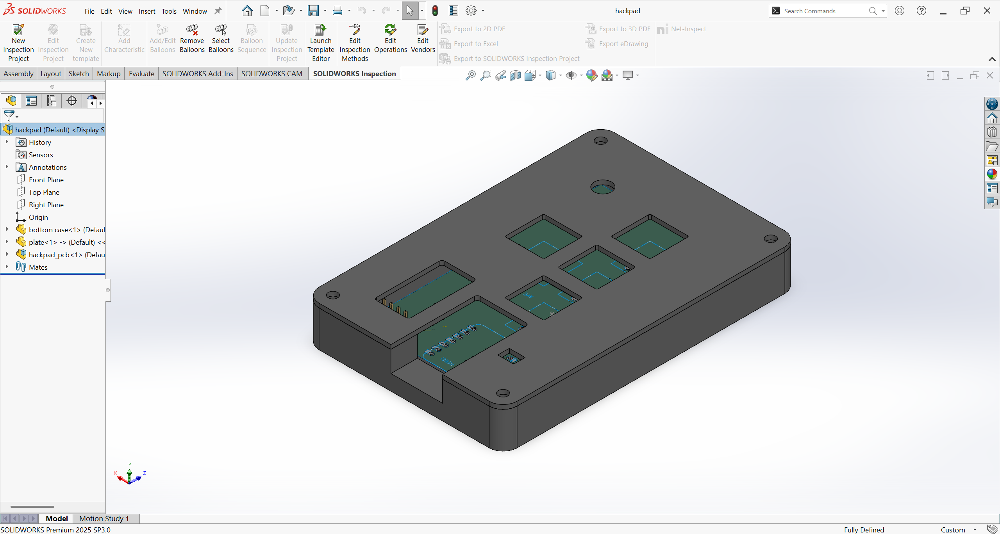
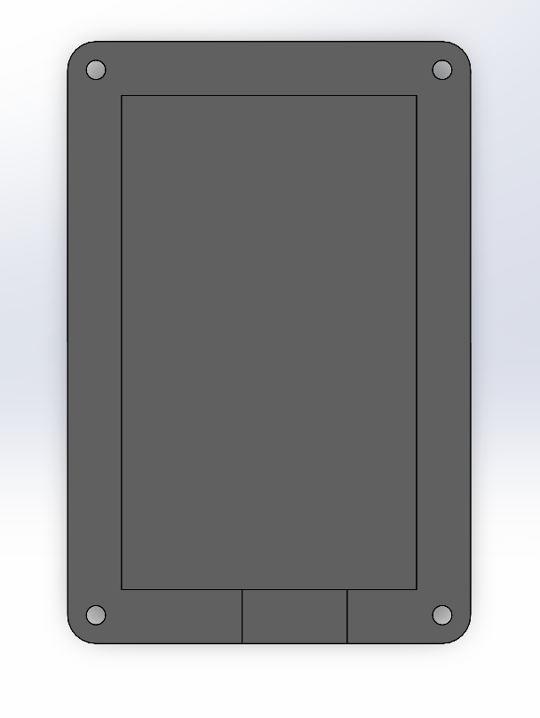
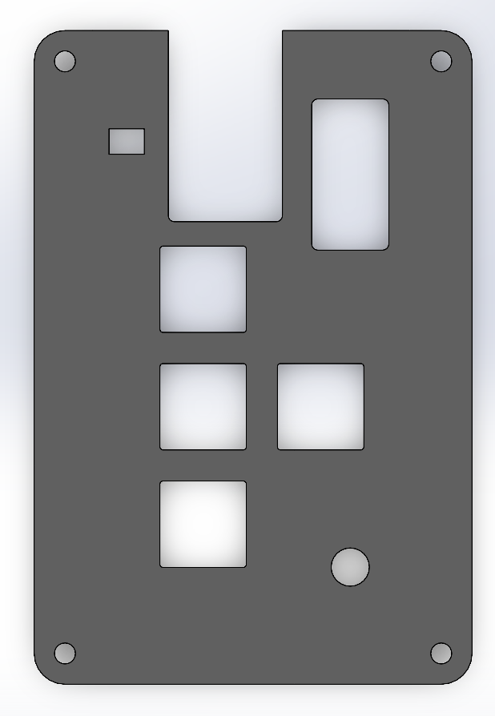
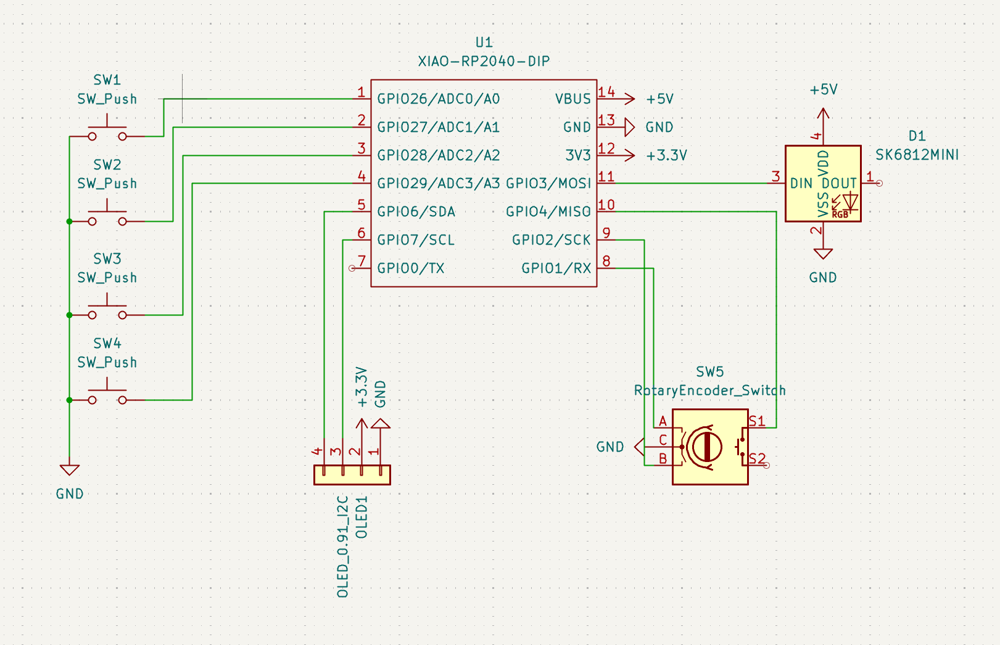
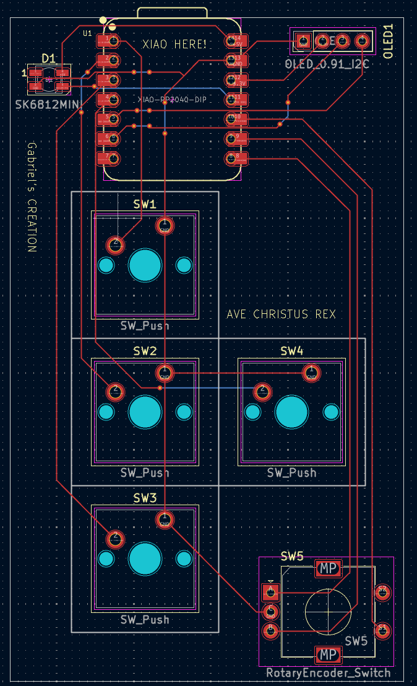

# Gabriel's CREATION

Finally my creation is ready...

## Hackpad

## Bottom case

## Plate

## Schematic

## PCB

## Challenges

This was my first time designing a PCB, it was really fun and exciting to do, i felt like i was really designing something that i could really use. Using KMK was a little difficult to use, i struggled trying to set the correct pins for my keys. Trying to understand how to layout the OLED connector (GND VCC SDA SCL) was a real nightmare, but at the end, it was a really rewarding experience.

## BOM

* 4x Cherry MX Switches
* 1x SK6812 MINI Leds
* 1x XIAO RP2040
* 4x Blank DSA Keycaps
* 4x M3x16 Bolt
* 4x M3 Heatset

others: 

* KMK Firmware
* Bottom case.STEP
* Plate.STEP

I used Solidworks to design the case, KiCAD for the PCB, and vscode to write the firmware.